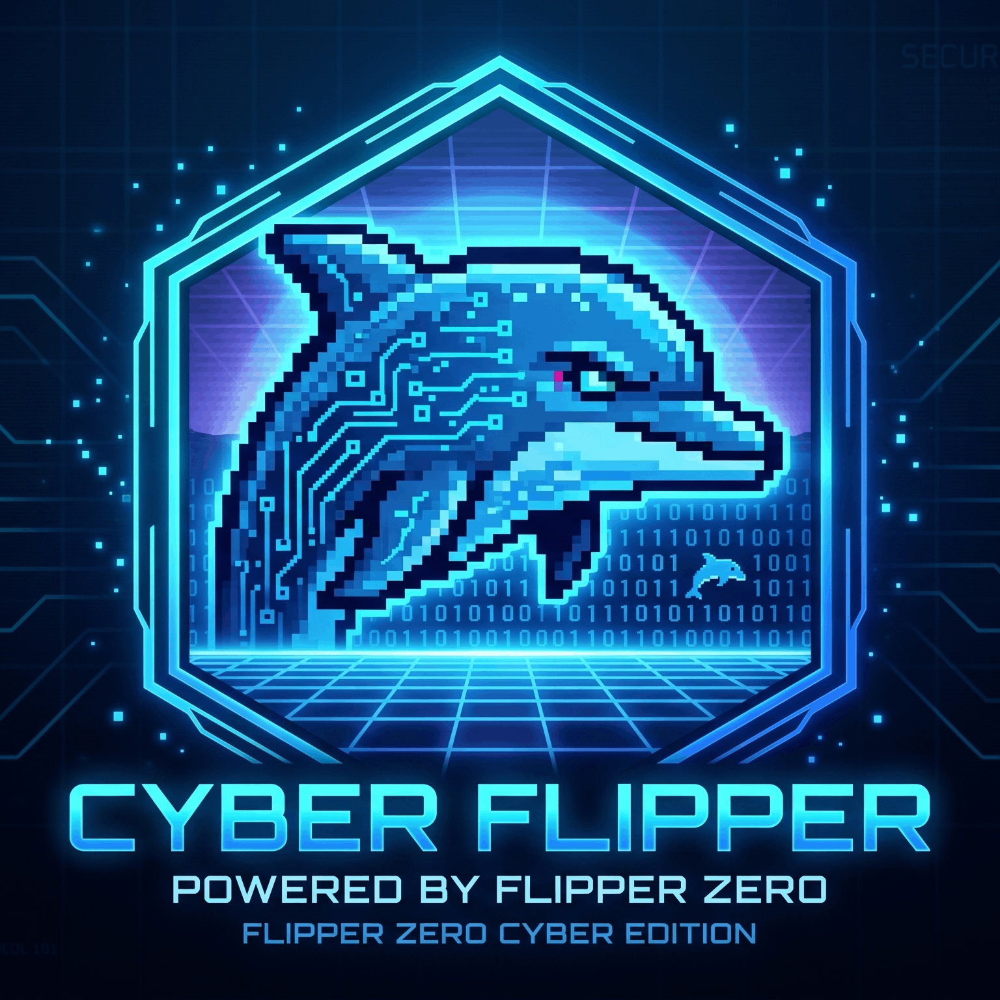
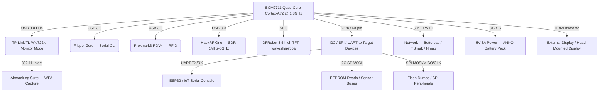

<p align="center">
  
</p>

<p align="center">
  <strong>[ CYBERDECK MK-1.0: PRODUCTION RELEASE v6.0.0 ]</strong><br>
  <em>Maintained by Personfu @ <a href="https://fllc.net">fllc.net</a></em><br>
  <strong>Official Discord: <a href="https://discord.gg/Cd9qyvht7X">discord.gg/Cd9qyvht7X</a></strong>
</p>

<p align="center">
  <a href="https://www.raspberrypi.com/products/raspberry-pi-400/"></a>
  <a href="https://www.raspberrypi.com/documentation/computers/raspberry-pi.html#raspberry-pi-400"></a>
  <a href="https://www.kali.org/get-kali/#kali-arm"></a>
  <a href="#"></a>
  <a href="https://github.com/Personfu/CYBERDECK"></a>
</p>

---

## ▓▒░ I. HARDWARE SCHEMATIC ARCHITECTURE

**CYBERDECK MK-1.0** is built natively on the **Raspberry Pi 400** — a keyboard-integrated single-board computer powered by the Broadcom **BCM2711** quad-core Cortex-A72 SoC. Unlike the MACOBOX (a €3,300 commercial hardware pentest platform), this CyberDeck is a **budget-first, open-source ops console** that uses the Pi400 purely as a **connection hub to test environments** — no voltage measurement, no bus probing, no MACOBOX adapter boards.

The Pi400's 40-pin GPIO header, four USB 3.0 ports, Gigabit Ethernet, and dual-band WiFi provide the physical backbone for connecting cyberdeck peripherals: Flipper Zero, Proxmark3, HackRF, O.MG Cable, Shark Jack, WiFi Pineapple, and the TP-Link TL-WN722N for monitor-mode packet injection.

*(For raw silicon engineering, cross-reference the official [Pi400 Product Brief](https://datasheets.raspberrypi.com/rpi400/raspberry-pi-400-product-brief.pdf) and the [BCM2711 Datasheet](https://datasheets.raspberrypi.com/bcm2711/bcm2711-peripherals.pdf).)*



---

## ▓▒░ II. PROTOCOL VECTORS & TELEMETRY MATRIX

| Vector | Hardware Driver | Operational Capabilities |
| :--- | :--- | :--- |
| **802.11 WiFi (Monitor)** | TP-Link TL-WN722N v2/v3 (RTL8188EUS) | Monitor mode, packet injection, WPA/WPA2 handshake capture via aircrack-ng. Requires `TPLINK_PATCH.sh` driver. |
| **802.11 WiFi (Managed)** | BCM43455 (onboard dual-band) | 2.4GHz + 5GHz station mode, AP mode, network recon via bettercap. |
| **Ethernet (GbE)** | BCM54213PE PHY | Gigabit wired tap, MITM via bettercap ARP spoof, Shark Jack loot retrieval over `172.16.24.1`. |
| **Bluetooth 5.0 BLE** | BCM43455 (onboard) | BLE scanning, beacon detection, device enumeration. Pairs with Flipper Zero BLE bridge. |
| **Sub-GHz RF** | CC1101 via Flipper Zero (USB serial) | Captures/replays ASK/OOK/GFSK remotes (315/433/868/915 MHz). Rolling code analysis (Keeloq, Somfy). |
| **125 kHz RFID** | Flipper Zero LF coil / Proxmark3 RDV4 | Read/write/emulate EM4100, HID Prox, Indala, T5577, FDX-B, Viking, Gallagher. |
| **13.56 MHz NFC** | Flipper Zero ST25R3916 / Proxmark3 RDV4 | MIFARE Classic/Ultralight/DESFire, ISO-14443A/B, FeliCa, HID iClass. Hardnested attacks via Proxmark. |
| **SDR (1 MHz–6 GHz)** | HackRF One / PortaPack H4M | Wideband capture, spectrum sweep, replay attacks, ADS-B decode, GSM analysis, ISM band monitoring. |
| **Infrared** | Flipper Zero diode array | Universal remote capture/replay. HVAC/AV control. IR brute-force for unknown protocols. |
| **GPIO / UART** | Pi400 GPIO14 (TX), GPIO15 (RX) | Serial console to ESP32, routers, IoT devices. Baud auto-detect. Boot log capture. |
| **GPIO / I2C** | Pi400 GPIO2 (SDA), GPIO3 (SCL) | EEPROM dumps, sensor bus enumeration, I2C address scanning via `i2cdetect`. |
| **GPIO / SPI** | Pi400 GPIO10/9/11/8/7 (MOSI/MISO/CLK/CE0/CE1) | Flash chip reads, DFRobot TFT display driver, SPI peripheral diagnostics. |
| **USB HID Injection** | O.MG Cable / Rubber Ducky | Keystroke injection, exfiltration, BadUSB payloads via WiFi AP at `192.168.4.1`. |
| **LAN Tap** | Shark Jack (Hak5) | Passive/active LAN audit on plug-in. Auto-nmap, loot retrieval via `172.16.24.1`. |
| **Rogue AP** | WiFi Pineapple (Hak5) | Evil twin, captive portal, client enumeration, MITM via `172.16.42.1` management API. |
| **iButton 1-Wire** | Flipper Zero (GPIO Pin 17) | Dallas DS1990A emulation, magnetic lock bypass analysis. |

---

## ▓▒░ III. PI400 HARDWARE TECHNICAL SPECIFICATIONS

> *Full specifications: [Official Raspberry Pi 400 Tech Specs](https://www.raspberrypi.com/products/raspberry-pi-400/specifications/) | [BCM2711 ARM Peripherals](https://datasheets.raspberrypi.com/bcm2711/bcm2711-peripherals.pdf)*

### 📐 Body & Form Factor

| Parameter | Value |
| :--- | :--- |
| **Form Factor** | Keyboard-integrated SBC (no separate board) |
| **Materials** | ABS plastic housing, chiclet keyboard |
| **Dimensions** | 286mm × 122mm × 23mm |
| **Weight** | 386g |
| **Keyboard** | 79-key compact (US/UK/EU layouts), 1.0mm travel |
| **Enclosure** | Adafruit CyberDeck kit (3D-printed faceplate, integrated pegs) |

### ⚙️ System-on-Chip (SoC)

| Parameter | Value |
| :--- | :--- |
| **SoC** | Broadcom BCM2711 |
| **CPU** | Quad-core ARM Cortex-A72 @ **1.8 GHz** (Pi400 overclocked from Pi4's 1.5GHz) |
| **Architecture** | ARMv8-A 64-bit |
| **GPU** | VideoCore VI @ 500 MHz |
| **OpenGL** | OpenGL ES 3.1, Vulkan 1.0 |
| **H.265 Decode** | 4Kp60 HEVC |
| **RAM** | 4 GB LPDDR4-3200 |
| **Process Node** | 28nm |

### 🗄️ Storage & Boot

| Parameter | Value |
| :--- | :--- |
| **Primary Storage** | MicroSD (UHS-I, max theoretical 50 MB/s) |
| **Recommended** | 32–128 GB Class 10 / A2 |
| **USB Boot** | Supported via EEPROM bootloader (see `rpi-eeprom-master/`) |
| **Network Boot** | PXE / TFTP supported (BCM2711 EEPROM `BOOT_ORDER=0xf41`) |
| **EEPROM** | SPI-attached 512KB bootloader EEPROM (updatable via `rpi-eeprom-update`) |

### 🌐 Networking (Onboard)

| Parameter | Value |
| :--- | :--- |
| **Ethernet** | Gigabit Ethernet (BCM54213PE PHY), true GbE (not USB-throttled) |
| **WiFi** | Dual-band 802.11ac (2.4GHz + 5GHz), BCM43455 |
| **Bluetooth** | Bluetooth 5.0, BLE |
| **Antenna** | Internal PCB antenna (certified: FCC / CE / UKCA) |

### 🔌 Ports & Connectivity

| Port | Count | Notes |
| :--- | :--- | :--- |
| **USB 3.0** | 2 | For Flipper, Proxmark, HackRF, TP-Link adapter |
| **USB 2.0** | 1 | For O.MG Cable, Rubber Ducky, misc peripherals |
| **USB-C** | 1 | Power input only (5V / 3A recommended) |
| **Micro HDMI** | 2 | Dual 4K display output (4Kp30 or 1080p60 each) |
| **MicroSD** | 1 | OS + data storage |
| **Ethernet (RJ45)** | 1 | Gigabit |
| **40-pin GPIO** | 1 | Full Raspberry Pi standard header |
| **Kensington Lock** | 1 | Physical security slot |

### 📟 GPIO Header (40-Pin)

| Function | Pins | Notes |
| :--- | :--- | :--- |
| **UART0** | GPIO14 (TX), GPIO15 (RX) | Serial console to ESP32 / routers / IoT |
| **I2C1** | GPIO2 (SDA), GPIO3 (SCL) | EEPROM reads, sensor buses |
| **SPI0** | GPIO10 (MOSI), GPIO9 (MISO), GPIO11 (SCLK), GPIO8 (CE0), GPIO7 (CE1) | Flash dumps, DFRobot TFT display |
| **PWM** | GPIO12, GPIO13, GPIO18, GPIO19 | LED control, audio, servo |
| **1-Wire** | GPIO4 (default) | Temperature sensors (DS18B20) |
| **Logic Level** | 3.3V CMOS | **⚠️ NOT 5V tolerant — use level shifters** |
| **Power Pins** | 5V (pin 2,4), 3.3V (pin 1,17), GND (pin 6,9,14,20,25,30,34,39) | Power peripherals directly |

### 🖥️ CyberDeck Display

| Parameter | Value |
| :--- | :--- |
| **Model** | DFRobot 3.5" TFT (ILI9486 / Waveshare compatible) |
| **Resolution** | 480×320 pixels (SPI mode) |
| **Interface** | SPI0 via GPIO header |
| **Touch** | Resistive (ADS7846 controller) |
| **Overlay** | `dtoverlay=waveshare35a` |
| **Rotation** | `rotate=270,invertx=1,swapxy=1` |
| **Framerate** | ~15–20 FPS (SPI bandwidth limited) |

### 📡 External WiFi Adapter

| Parameter | Value |
| :--- | :--- |
| **Model** | TP-Link TL-WN722N v2/v3 |
| **Chipset** | RTL8188EUS (v2) / RTL8188EU (v3) |
| **Driver** | `8188eu` (aircrack-ng/rtl8188eus patched) |
| **Monitor Mode** | ✅ Yes (after `TPLINK_PATCH.sh`) |
| **Packet Injection** | ✅ Yes |
| **Frequency** | 2.4 GHz only |
| **Antenna** | External 4 dBi omnidirectional (detachable RP-SMA) |

### 🔋 Power

| Parameter | Value |
| :--- | :--- |
| **Input** | USB-C, 5V / 3A (15W) |
| **Battery** | ANKO 10,000mAh portable pack (5V / 2.4A USB-C output) |
| **Runtime** | ~3–4 hours field use (with TFT, WiFi adapter, Flipper) |
| **Idle Draw** | ~2.7W (no peripherals) |
| **Max Draw** | ~6.4W (all USB ports loaded, WiFi active, CPU 100%) |
| **Operating Temp** | 0°C to 50°C (throttles at 80°C core) |

---

## ▓▒░ IV. EEPROM BOOTLOADER ENGINEERING

The Pi400 uses a **SPI-attached 512KB EEPROM** for its bootloader — this is fundamentally different from all prior Raspberry Pi models which booted exclusively from the SD card's GPU firmware blob. The EEPROM bootloader controls boot order, USB boot, network boot, and power management.

This repository includes the complete **[rpi-eeprom](https://github.com/raspberrypi/rpi-eeprom)** toolkit in `rpi-eeprom-master/`:

```
rpi-eeprom-master/
├── firmware-2711/       BCM2711 (Pi4/Pi400) bootloader binaries
│   ├── stable/          Production-ready EEPROM images
│   ├── beta/            Development builds
│   └── old/             Archived releases
├── firmware-2712/       BCM2712 (Pi5) bootloader binaries
├── imager/              Raspberry Pi Imager EEPROM config templates
│   └── 2711-config/
│       ├── boot-conf-sd.txt       SD card boot (default)
│       ├── boot-conf-usb.txt      USB mass storage boot
│       └── boot-conf-network.txt  PXE network boot
├── test/                Test configs spanning 2019–2022 bootloader revisions
├── tools/               vl805, rpi-bootloader-key-convert, rpi-otp-private-key
├── rpi-eeprom-config    Read/write EEPROM config from binary images
├── rpi-eeprom-digest    Generate SHA-256 digests for signed boot
├── rpi-eeprom-update    Main update utility
└── releases.md          BCM2711 + BCM2712 release notes index
```

### EEPROM Boot Configuration (CyberDeck Default)

```ini
# /boot/firmware/boot.conf (or via rpi-eeprom-config)
[all]
BOOT_UART=0              # Disable UART boot debug (enable with 1 for serial console boot logs)
WAKE_ON_GPIO=1           # Wake from halt via GPIO (useful for field power button)
ENABLE_SELF_UPDATE=1     # Allow EEPROM self-update from /boot partition
BOOT_ORDER=0xf41         # Try: SD → USB → Network → Restart
NET_INSTALL_AT_POWER_ON=1  # Enable network install when no bootable media found
```

### EEPROM Update Commands

```bash
# Check current EEPROM version
sudo rpi-eeprom-update

# Flash latest stable bootloader
sudo rpi-eeprom-update -a
sudo reboot

# Extract config from a binary EEPROM image
rpi-eeprom-config pieeprom-2024-01-05.bin

# Write custom config to EEPROM image
rpi-eeprom-config --config boot.conf --out custom-pieeprom.bin pieeprom-2024-01-05.bin

# USB boot setup (write USB boot config)
sudo rpi-eeprom-config --config rpi-eeprom-master/imager/2711-config/boot-conf-usb.txt
```

### Secure Boot (Advanced)

The BCM2711 EEPROM supports **signed boot** via RSA-2048 keys stored in OTP (one-time programmable) fuses:

```bash
# Generate signing keypair
openssl genrsa -out private.pem 2048
openssl rsa -in private.pem -outform PEM -pubout -out public.pem

# Sign EEPROM image
rpi-eeprom-digest --key private.pem --type rsa2048 --out pieeprom-signed.bin pieeprom.bin

# Program public key to OTP (IRREVERSIBLE — locks to this key)
rpi-otp-private-key -w public.pem
```

> **⚠️ OTP key programming is PERMANENT and IRREVERSIBLE. Only use for production CyberDeck deployments where boot integrity is mandatory.**

---

## ▓▒░ V. EDC ECOSYSTEM & PERIPHERAL MODULARITY

CYBERDECK MK-1.0 serves as the **central ops hub** for an extensive Everyday Carry (EDC) loadout. The Pi400 connects to and orchestrates the greatest cybersecurity peripherals on the market:

*   **Wireless Exploitation & Capture:**
    *   📡 **[TP-Link TL-WN722N](https://www.tp-link.com/us/home-networking/usb-adapter/tl-wn722n/):** Primary monitor-mode adapter. Driver-patched via `TPLINK_PATCH.sh` (credit: David Bombal). Aircrack-ng native.
    *   📡 **[Alfa AWUS036ACHM](https://lab401.com/products/alpha-awus036achm):** Drop-in upgrade — dual-band, mt76 driver, native Linux monitor mode. No patching required.
    *   📡 **[Hak5 WiFi Pineapple](https://shop.hak5.org/products/wifi-pineapple):** Rogue AP, evil twin, captive portal, client MITM. Management API at `172.16.42.1`.

*   **RFID / NFC / Access Control:**
    *   🔑 **[Flipper Zero](https://flipperzero.one/):** Sub-GHz, 125kHz RFID, 13.56MHz NFC, IR, GPIO, iButton, BadUSB. Connected via USB serial `/dev/ttyACM0`.
    *   🔑 **[Proxmark3 RDV4](https://lab401.com/products/proxmark-3-rdv4):** Professional RFID research tool. Hardnested MIFARE Classic attacks, HID iClass, T5577 cloning.
    *   🔑 **[Chameleon Ultra](https://lab401.com/products/chameleon-ultra):** RFID emulation device — LF + HF, on-device storage for multiple card profiles.

*   **Software Defined Radio (SDR):**
    *   📻 **[HackRF One](https://greatscottgadgets.com/hackrf/one/):** 1 MHz–6 GHz half-duplex transceiver. Captures, replays, and analyzes RF signals.
    *   📻 **[PortaPack H4M](https://lab401.com/products/portapack-h4m):** Standalone HackRF with screen. Mayhem firmware for field RF capture.
    *   📻 **[RTL-SDR v4](https://www.rtl-sdr.com/rtl-sdr-blog-v4-dongle/):** Budget wideband receiver (500kHz–1.766GHz). ADS-B, FM, ISM monitoring.
    *   📻 **[TinySA Ultra+](https://lab401.com/products/tinysa-ultra):** Portable spectrum analyzer. Visual RF monitoring 100kHz–5.3GHz.

*   **USB Implant & HID Injection:**
    *   🦆 **[O.MG Cable](https://lab401.com/products/o-mg-cable):** WiFi-enabled USB implant. Keystroke injection, exfiltration, geofencing.
    *   🦆 **[Hak5 Rubber Ducky](https://shop.hak5.org/products/usb-rubber-ducky):** USB keystroke injection. DuckyScript payloads execute in seconds.
    *   🦆 **[Hak5 Bash Bunny Mark II](https://lab401.com/products/hid-emulator-bash-bunny):** Multi-vector USB attack platform. Ethernet, serial, storage, HID emulation.

*   **Network Tap & LAN Audit:**
    *   🦈 **[Hak5 Shark Jack](https://lab401.com/products/shark-jack):** Keyring-sized LAN tap. Auto-nmap on plug-in, loot retrieval via SSH.
    *   🦈 **[Hak5 Packet Squirrel Mark II](https://lab401.com/products/packet-squirrel-mark-ii):** Inline ethernet multi-tool. MITM, capture, VPN tunnel.
    *   🦈 **[Hak5 Plunder Bug](https://lab401.com/products/hak5-plunder-bug-lan-sniffer):** Passive LAN tap. Non-intrusive monitoring.

*   **Hardware Debugging & Analysis:**
    *   🔬 **[I2CDriver](https://lab401.com/products/i2c-driver):** USB I2C host adapter for bus monitoring, EEPROM dumping, sensor interaction.
    *   🔬 **[SPIDriver](https://lab401.com/products/spi-driver):** USB SPI host adapter for flash chip reads, firmware extraction.
    *   🔬 **[TermDriver 2](https://lab401.com/products/termdriver2):** USB-to-serial with built-in screen. Real-time UART monitoring.
    *   🔬 **[BugBlat miniSniffer v2](https://lab401.com/products/bugblat-minisniffer-v2):** USB protocol analyzer. Debug USB communication issues.

*   **Remote Access & KVM:**
    *   🖥️ **[PiKVM v4 Plus](https://lab401.com/products/pikvm-v4-plus-hardware-rat):** Hardware KVM-over-IP. Remote BIOS access, virtual media, power control.
    *   🖥️ **[Hak5 Screen Crab](https://lab401.com/products/hak5-screen-crab):** HDMI man-in-the-middle. Screenshot capture and exfiltration.

*   **RFID Security Testing:**
    *   🛡️ **[NFCKill Professional](https://lab401.com/products/nfckill-professional-version):** RFID fuzzing tool for testing RFID hardware resilience.
    *   🛡️ **[SkimmerGuard](https://lab401.com/products/skimmerguard):** ATM skimmer detection device.
    *   🛡️ **[RFID Field Detector Ultra](https://lab401.com/products/rfid-field-detector-ultra):** LF/HF/UHF field detection.

*   **Cyber-Analytic Software Toolchains:**
    *   🛠️ **[CyberChef (GCHQ)](https://github.com/gchq/CyberChef):** Data encoding, decoding, encryption, compression, hashing — the cyber Swiss Army knife.
    *   🛠️ **[SecLists](https://github.com/danielmiessler/SecLists):** Wordlists, fuzzing payloads, discovery lists, pattern matching.
    *   🛠️ **[OWASP CheatSheet Series](https://github.com/OWASP/CheatSheetSeries):** Security best practices for web, API, mobile, cloud.
    *   🛠️ **[Awesome-Hacking](https://github.com/Hack-with-Github/Awesome-Hacking):** Curated security tool index.

---

## ▓▒░ VI. CVE SCENARIO PLAYBOOKS

Real-world scenarios demonstrating CyberDeck MK-1.0 workflows against documented CVEs in **authorized lab environments**.

### Scenario 1: WPA2 KRACK Key Reinstallation Attack (CVE-2017-13077)

**CVE:** [CVE-2017-13077](https://nvd.nist.gov/vuln/detail/CVE-2017-13077) — Wi-Fi Protected Access (WPA/WPA2) allows reinstallation of the pairwise encryption key (PTK-TK) during the four-way handshake.

**Impact:** CVSS 6.8 (MEDIUM) — Allows an attacker within WiFi range to decrypt, replay, and inject packets.

**CyberDeck Workflow:**
```
cyberdeck> wireless
Action [monitor_on/monitor_off/airodump/deauth/crack]: monitor_on
WiFi interface: wlan1
» sudo airmon-ng start wlan1

cyberdeck> wireless
Action: airodump
Channel: 6
» sudo airodump-ng wlan1mon -w ~/CYBERDECK/captures/airodump_20260420_143022 -c 6

# Identify target AP (BSSID) and connected client (STATION)
# In separate terminal:

cyberdeck> wireless
Action: deauth
Target BSSID: AA:BB:CC:DD:EE:FF
Deauth packets: 5
» sudo aireplay-ng --deauth 5 -a AA:BB:CC:DD:EE:FF wlan1mon

# Capture WPA 4-way handshake in the airodump pcap
# Verify KRACK vulnerability by checking if client reinstalls PTK-TK

cyberdeck> pcap
PCAP file path: ~/CYBERDECK/captures/airodump_20260420_143022-01.cap
Action: conversations
» tshark -r ~/CYBERDECK/captures/airodump_20260420_143022-01.cap -q -z conv,tcp

# Document finding in report via web platform
```

**Remediation:** Update all client devices and APs to firmware versions released after October 2017 that implement the KRACK patches.

---

### Scenario 2: MIFARE Classic Hardnested Attack (CVE-2015-2908)

**CVE:** [CVE-2015-2908](https://nvd.nist.gov/vuln/detail/CVE-2015-2908) — MIFARE Classic cards use the Crypto-1 cipher which is fundamentally broken, allowing key recovery from a single known sector key.

**Impact:** CVSS 7.5 (HIGH) — Full credential cloning for physical access control systems using MIFARE Classic.

**CyberDeck Workflow:**
```
cyberdeck> proxmark
Action [lf_search/hf_search/lf_read/hf_read/flash]: hf_search
» proxmark3 /dev/ttyACM0 -c 'hf search'

# Proxmark identifies MIFARE Classic 1K, reads UID
# Run hardnested attack against sector 0 using known default key A0A1A2A3A4A5:

proxmark3> hf mf hardnested --blk 0 -a -k A0A1A2A3A4A5 --tblk 4 -a

# Keys recovered → dump all sectors:
proxmark3> hf mf autopwn

# Export dump for analysis:
proxmark3> hf mf dump --file ~/CYBERDECK/loot/mifare_dump_20260420.bin
```

**Remediation:** Migrate from MIFARE Classic to MIFARE DESFire EV2/EV3 or HID iCLASS SE which use AES-128 instead of Crypto-1.

---

### Scenario 3: DNS Rebinding Against IoT Devices (CVE-2019-11477 + IoT Context)

**CVE:** [CVE-2019-11477](https://nvd.nist.gov/vuln/detail/CVE-2019-11477) (SACK Panic) — Linux kernel TCP implementation allows remote denial of service via crafted SACK segments. Affects unpatched IoT devices running Linux 2.6.29+.

**Impact:** CVSS 7.5 (HIGH) — Remote kernel panic on any reachable Linux-based IoT device.

**CyberDeck Workflow:**
```
# Discover IoT devices on local network
cyberdeck> arpscan
Interface: eth0
Subnet: 192.168.1.0/24
» sudo arp-scan --interface=eth0 192.168.1.0/24

# Profile discovered devices with service enumeration
cyberdeck> services
Target: 192.168.1.50
Intensity: full
» sudo nmap -sV -sC -p- -T4 192.168.1.50 -oA ~/CYBERDECK/reports/service_enum_20260420_150112

# Check kernel version via SSH banner or HTTP headers
cyberdeck> pcap
PCAP file: ~/CYBERDECK/captures/iot_traffic.pcap
Action: http
» tshark -r ~/CYBERDECK/captures/iot_traffic.pcap -Y "http.request" -T fields -e http.host -e http.request.uri

# Document: Device runs Linux 4.9 kernel, vulnerable to SACK Panic
# Recommend: Apply kernel patch or set net.ipv4.tcp_sack=0
```

**Remediation:** `sysctl -w net.ipv4.tcp_sack=0` as temporary mitigation, then update kernel to 4.4.182+, 4.9.182+, or 4.14.127+.

---

### Scenario 4: Sub-GHz Replay Attack on Garage Door (CVE-N/A — Protocol Weakness)

**Vulnerability:** Fixed-code ASK/OOK garage door remotes transmit the same code on every press. No rolling code, no encryption.

**Impact:** Complete access to any facility using fixed-code remotes at 315/433 MHz.

**CyberDeck Workflow:**
```
cyberdeck> flipper
Flipper serial port: /dev/ttyACM0
Action [info/subghz_rx/rfid_read/ir_rx/gpio_status]: subghz_rx
» echo "subghz rx" > /dev/ttyACM0

# Flipper captures OOK signal at 433.92 MHz
# Signal saved to Flipper SD: /ext/subghz/saved/garage_capture.sub

# Verify with HackRF spectrum sweep:
cyberdeck> hackrf
Action [info/rx/tx/sweep]: sweep
Start freq MHz: 430
End freq MHz: 440
» hackrf_sweep -f 430:440

# Document: Fixed code at 433.92 MHz, OOK modulation, no rolling code
# Recommend: Replace with rolling-code system (Keeloq minimum, AES preferred)
```

---

### Scenario 5: Cleartext Credential Capture on Legacy Network (CVE-N/A — Protocol Design)

**Vulnerability:** FTP, HTTP Basic Auth, Telnet, POP3 transmit credentials in cleartext.

**CyberDeck Workflow:**
```
# Capture network traffic
cyberdeck> tshark
Interface: eth0
Output file: (auto-generated)
Capture filter: port 21 or port 80 or port 23 or port 110

# Let it run, then analyze offline
cyberdeck> pcap
PCAP file: ~/CYBERDECK/captures/tshark_20260420_160045.pcapng
Action: credentials
» tshark -r ~/CYBERDECK/captures/tshark_20260420_160045.pcapng \
    -Y "http.authbasic or ftp.request.command==PASS or pop.request.command==PASS" \
    -T fields -e ip.src -e http.authbasic -e ftp.request.arg -e pop.request.arg

# Extract DNS queries to map internal infrastructure
cyberdeck> pcap
Action: dns
» tshark -r ~/CYBERDECK/captures/tshark_20260420_160045.pcapng \
    -Y "dns.qry.name" -T fields -e dns.qry.name | sort -u

# Document: 3 FTP servers, 1 Telnet switch, all cleartext
# Recommend: Enforce SFTP/FTPS, SSH, HTTPS across all services
```

---

### Scenario 6: Bluetooth Low Energy (BLE) Sniffing — Smart Lock Replay (CVE-2020-15509)

**CVE:** [CVE-2020-15509](https://nvd.nist.gov/vuln/detail/CVE-2020-15509) — Multiple BLE smart lock manufacturers use static BLE characteristics that can be replayed.

**CyberDeck Workflow:**
```
# Scan for BLE devices using Pi400 onboard BT
cyberdeck> sysinfo
» hcitool lescan --duplicates

# Capture BLE traffic with Flipper Zero
cyberdeck> flipper
Action: subghz_rx    # (BLE analysis via custom Flipper app or external tools)

# Or use dedicated BLE sniffer:
» sudo btlejuice-proxy -u AA:BB:CC:DD:EE:FF
» sudo btlejuice

# Document: Smart lock accepts replayed BLE unlock command
# Recommend: Implement challenge-response authentication in firmware
```

---

## ▓▒░ VII. INSTALLATION — FULL PI400 CYBERDECK BUILD

### Prerequisites

| Component | Source |
| :--- | :--- |
| Raspberry Pi 400 | [raspberrypi.com](https://www.raspberrypi.com/products/raspberry-pi-400/) |
| Kali Linux ARM64 | [kali.org/get-kali](https://www.kali.org/get-kali/#kali-arm) |
| 32GB+ MicroSD (A2) | Any reputable brand |
| DFRobot 3.5" TFT | [dfrobot.com](https://www.dfrobot.com/) or Waveshare equivalent |
| Adafruit CyberDeck | [adafruit.com](https://www.adafruit.com/) |
| TP-Link TL-WN722N v2/v3 | Amazon / eBay / local electronics |
| ANKO 10,000mAh battery | 5V / 2A+ USB-C output |

### Step 1: Flash Kali ARM64

```bash
# Download Kali ARM64 for Raspberry Pi
wget https://kali.download/arm-images/kali-2024.4/kali-linux-2024.4-raspberry-pi-arm64.img.xz

# Flash to MicroSD (replace /dev/sdX with your card)
xzcat kali-linux-2024.4-raspberry-pi-arm64.img.xz | sudo dd of=/dev/sdX bs=4M status=progress
sync
```

### Step 2: Clone & Install CyberDeck

```bash
git clone https://github.com/Personfu/CYBERDECK.git
cd CYBERDECK

# Install LCD display drivers (reboots required)
sudo ./REQUIREMENTS_PATCH.sh
sudo reboot

sudo ./LCD_INSTALLER.sh
sudo reboot

# Patch TP-Link for monitor mode
sudo ./TPLINK_PATCH.sh
sudo reboot

# Install core tools
sudo apt update && sudo apt install -y \
    tshark tcpdump nmap hashcat bettercap \
    aircrack-ng arp-scan dnsutils minicom i2c-tools \
    python3 python3-pip curl jq

# Optional: Proxmark3 client
sudo apt install -y proxmark3

# Optional: HackRF tools
sudo apt install -y hackrf
```

### Step 3: Launch CyberDeck Console

```bash
# Run directly
python3 F600_AstraAudit.py

# Or install as system command
chmod +x F600_AstraAudit.py
sudo ln -sf $(pwd)/F600_AstraAudit.py /usr/local/bin/cyberdeck
cyberdeck
```

### Step 4: EEPROM Bootloader Update (Optional)

```bash
# Update Pi400 EEPROM to latest stable
sudo rpi-eeprom-update -a
sudo reboot

# Or use included rpi-eeprom tools for custom boot config
cd rpi-eeprom-master/rpi-eeprom-master
./rpi-eeprom-config /lib/firmware/raspberrypi/bootloader/stable/pieeprom-*.bin
```

### Step 5: Web Platform (Optional)

```bash
cd infra/docker
docker compose up --build
# Web UI → http://localhost:3000
# API   → http://localhost:8000
```

---

## ▓▒░ VIII. CLI OPS CONSOLE — F600_AstraAudit.py v6.0.0

### Tool Matrix (20 Tools, 4 Categories)

| Category | Command | Tool | Description |
| :--- | :--- | :--- | :--- |
| **Network Capture** | `bettercap` | Bettercap | MITM, ARP spoof, network recon, web UI |
| | `tshark` | TShark | Deep packet capture, protocol analysis, display filters |
| | `tcpdump` | Tcpdump | Lightweight packet capture, BPF filters |
| | `nmap` | Nmap | Port/service scan, OS fingerprint, NSE scripts |
| | `hashcat` | Hashcat | Offline hash cracking (WPA, NTLM, MD5, SHA) |
| **Analyst Recon** | `wireless` | Aircrack-ng | Monitor mode, airodump, deauth, WPA crack |
| | `arpscan` | ARP-scan | Fast LAN host discovery via ARP broadcast |
| | `services` | Nmap -sV -sC | Service version + default script scan (quick/full/vuln) |
| | `pcap` | TShark (offline) | Protocol hierarchy, HTTP extract, DNS queries, credentials, conversations |
| | `dns` | dig | DNS lookup, zone transfer, reverse lookup, subdomain brute |
| **Peripherals** | `flipper` | Flipper Zero | Sub-GHz RX, RFID read, IR RX, GPIO status, device info |
| | `proxmark` | Proxmark3 RDV4 | LF/HF search, read, 14A reader, firmware flash |
| | `hackrf` | HackRF One | Info, RX capture, spectrum sweep |
| | `omg` | O.MG Cable | Status check, payload push, exfil via WiFi AP |
| | `sharkjack` | Shark Jack | Auto-scan results, loot retrieval via SSH/SCP |
| | `pineapple` | WiFi Pineapple | Status, recon start, client enumeration via HTTPS API |
| **Pi400 Ops** | `gpio` | GPIO Tools | I2C scan, SPI probe, UART minicom, GPIO readall |
| | `sysinfo` | System Info | CPU temp, memory, disk, interfaces, USB devices, GPIO |
| | `sessions` | Session Browser | Browse/search JSON session logs with timestamps |
| | `toolcheck` | Dependency Check | Verify all 20+ required binaries are installed |

### Session Logging

Every tool execution is automatically logged to `~/CYBERDECK/sessions/` as timestamped JSON:

```json
{
  "timestamp": "2026-04-20T14:30:22.451293",
  "tool": "nmap",
  "details": {
    "target": "192.168.1.0/24",
    "scan": "-sS"
  }
}
```

### Directory Structure

```
~/CYBERDECK/
├── sessions/    JSON session logs (auto-created)
├── captures/    PCAP files, nmap output, airodump captures
├── reports/     Service enumeration results (nmap -oA)
└── loot/        ARP scans, RFID dumps, exfiltrated data
```

---

## ▓▒░ IX. WEB PLATFORM — DOCKER COMPOSE

| Service | URL | Tech |
|---------|-----|------|
| Web UI | http://localhost:3000 | Express + cyberpunk HTML |
| API | http://localhost:8000 | FastAPI + Pydantic |
| Health | http://localhost:8000/healthz | → `{"status": "ONLINE"}` |

### Default Login
| Username | Password |
|----------|----------|
| `admin` | `cyberdeck` |

### API Routes

```
GET    /healthz                          Health check
POST   /auth/login                       JWT authentication
GET    /projects                         List projects
POST   /projects                         Create project
GET    /projects/{id}                    Project detail
GET    /projects/{id}/targets            List targets
POST   /projects/{id}/targets            Add target
GET    /projects/{id}/targets/export.csv CSV export
POST   /projects/{id}/targets/import     CSV import
GET    /projects/{id}/sessions           List hardware sessions
POST   /projects/{id}/sessions           Create session
GET    /reports                          List reports
POST   /reports/generate                 Generate report
GET    /reports/{id}                     Report detail
GET    /reports/{id}/view                Printable HTML view
POST   /upload                           Upload evidence (SHA-256 auto)
GET    /uploads/{artifact_id}/{filename} Download artifact
POST   /ai/summarize                     AI summarisation
POST   /ai/draft-finding                 AI finding draft
POST   /ai/suggest-names                 AI naming suggestions
POST   /ai/cluster                       AI evidence clustering
POST   /ai/assist-report                 AI report assistant
```

### Reports & Severity Matrix

| Level | CVSS | Color |
|-------|------|-------|
| **CRITICAL** | 9.0–10.0 | Red |
| **HIGH** | 7.0–8.9 | Orange |
| **MEDIUM** | 4.0–6.9 | Yellow |
| **LOW** | 0.1–3.9 | Cyan |
| **INFO** | 0.0 | Gray |

---

## ▓▒░ X. DISPLAY CONFIGURATION — `/boot/config.txt`

```ini
# DFRobot 3.5" TFT via SPI (waveshare35a compatible)
dtoverlay=waveshare35a,rotate=270,invertx=1,swapxy=1

# HDMI output for external display (optional, for dual-screen cyberdeck)
hdmi_force_hotplug=1
hdmi_group=2
hdmi_mode=87
hdmi_cvt 1280 480 60 6 0 0 0

# Pi400 overclock (already factory-set to 1.8GHz but can push further)
# WARNING: Voids warranty, requires active cooling
# over_voltage=6
# arm_freq=2000

# GPU memory split (more RAM for tools, less for GPU)
gpu_mem=64

# Enable I2C, SPI for hardware sessions
dtparam=i2c_arm=on
dtparam=spi=on
```

---

## ▓▒░ XI. REPOSITORY LAYOUT

```
CYBERDECK/
├── F600_AstraAudit.py              CLI ops console v6.0.0 (20 tools, 4 categories)
├── CYBERFLIPPER_Logo.png           Project logo / branding
├── LICENSE.md                      GNU GPLv3
├── README.md                       This file
├── CLAUDE.md                       AI assistant context document
├── README-FLLC.md                  FLLC internal notes
├── requirements.txt                System dependency documentation
├── pirate_net.txt                  PirateBox Pi0W networking notes
│
├── apps/
│   ├── api/                        FastAPI backend (auth, CRUD, upload, CSV, AI, reports)
│   │   ├── main.py                 API entry point
│   │   ├── models.py               Pydantic data models
│   │   ├── ai_adapter.py           Ollama / OpenAI-compatible adapter
│   │   ├── seed.py                 First-boot seed data
│   │   ├── test_api.py             Pytest test suite
│   │   └── reqs.txt                Python dependencies
│   ├── web/                        Express + cyberpunk HTML UI
│   │   └── package.json
│   └── worker/                     Background report generation
│       ├── worker.py
│       └── reqs.txt
│
├── docs/
│   ├── ARCHITECTURE.md             System design & service diagram
│   ├── HARDWARE_WORKFLOWS.md       Peripheral integration guide
│   ├── SAFETY_BOUNDARY.md          What this tool does and does NOT do
│   ├── REPORTING.md                Report generation guide
│   └── LOCAL_AI.md                 Ollama / local LLM configuration
│
├── hardware/
│   ├── session-template-uart.md    UART session documentation template
│   ├── session-template-i2c.md     I2C session documentation template
│   ├── session-template-spi.md     SPI session documentation template
│   ├── session-template-jtag.md    JTAG/SWD session documentation template
│   └── session-template-emmc.md    eMMC session documentation template
│
├── rpi-eeprom-master/              Complete Pi EEPROM bootloader toolkit
│   └── rpi-eeprom-master/
│       ├── firmware-2711/          BCM2711 (Pi4/Pi400) bootloader binaries
│       ├── firmware-2712/          BCM2712 (Pi5) bootloader binaries
│       ├── imager/                 Boot config templates (SD, USB, Network)
│       ├── test/                   Historical boot configs (2019–2022)
│       ├── tools/                  vl805, key convert, OTP, sign utilities
│       ├── rpi-eeprom-config       EEPROM config read/write tool
│       ├── rpi-eeprom-digest       SHA-256 digest generator
│       ├── rpi-eeprom-update       Main EEPROM update utility
│       └── releases.md             Release notes index
│
├── scripts/
│   ├── lcd_install.sh              DFRobot/waveshare TFT driver installer
│   ├── tplink_patch.sh             TP-Link TL-WN722N monitor-mode driver
│   ├── requirements_setup.sh       System package installer
│   ├── start.sh                    Docker start script
│   └── test.sh                     Test runner
│
├── REQUIREMENTS_PATCH.sh           Legacy SATUNIX requirements patch
├── LCD_INSTALLER.sh                Legacy SATUNIX LCD installer
├── TPLINK_PATCH.sh                 Legacy SATUNIX TP-Link patch
│
├── infra/docker/                   docker-compose.yml
├── packages/                       Shared config / UI packages
├── .github/workflows/              CI (pytest, Docker, LaTeX) + Release pipelines
└── .gitignore
```

---

## ▓▒░ XII. SAFETY BOUNDARY

This platform is for **authorized network auditing and lab hardware documentation** in controlled test environments.

| ✅ AUTHORIZED | ❌ PROHIBITED |
| :--- | :--- |
| Network auditing with written scope | Unauthorized network intrusion |
| RFID/NFC research on owned devices | Cloning access cards without authorization |
| WiFi capture in controlled lab | Deauthing production networks |
| Hardware session documentation | Exploiting devices you don't own |
| CVE reproduction in isolated lab | Weaponized exploit delivery |
| AI-assisted report drafting | AI-generated payloads or malware |

> **This is NOT a MACOBOX.** No voltage measurement, no bus probing, no €3,300 hardware adapter.
> The Pi400 is a **connection hub** to test environments — a keyboard you carry into the lab.

See [`docs/SAFETY_BOUNDARY.md`](docs/SAFETY_BOUNDARY.md) for the full policy.

---

## ▓▒░ XIII. CI/CD & TESTING

| Workflow | Triggers | Jobs |
|----------|----------|------|
| `ci.yml` | push main/develop, PRs | pytest, LaTeX PDF build, Docker build matrix, Compose smoke test |
| `release.yml` | `v*` tags | GHCR image push, GitHub Release with PDF artifacts |

```bash
# Run tests locally
cd apps/api
pip install -r reqs.txt
pytest test_api.py -v
```

---

## ▓▒░ XIV. CREDITS & HERITAGE

| Contributor | Contribution |
| :--- | :--- |
| **[SATUNIX/CYBERDECK](https://github.com/SATUNIX/CYBERDECK)** | Original Pi400 CyberDeck build scripts, hardware BOM, F600_AstraAudit concept |
| **[David Bombal](https://github.com/davidbombal)** | TP-Link TL-WN722N driver patch method for Kali ARM |
| **[Adafruit](https://www.adafruit.com/)** | CyberDeck enclosure design and mounting hardware |
| **[DFRobot / Waveshare](https://www.dfrobot.com/)** | 3.5" TFT display and SPI driver |
| **[Raspberry Pi Foundation](https://www.raspberrypi.com/)** | Pi400 hardware, rpi-eeprom bootloader toolkit, BCM2711 documentation |
| **[Zack Freedman](https://www.youtube.com/@ZackFreedman)** | Voidstar Data Blaster — the cyberdeck that inspired the form factor |
| **[Lab401](https://lab401.com/)** | Pentesting hardware catalog and community |
| **[Hak5](https://shop.hak5.org/)** | Shark Jack, WiFi Pineapple, Rubber Ducky, Packet Squirrel, Screen Crab, Bash Bunny |
| **[Flipper Devices](https://flipperzero.one/)** | Flipper Zero multi-tool |
| **[Great Scott Gadgets](https://greatscottgadgets.com/)** | HackRF One SDR platform |

### 🔗 Community

➡️ **Discord: [discord.gg/Cd9qyvht7X](https://discord.gg/Cd9qyvht7X)**
➡️ **Reddit: [r/cyberdeck](https://www.reddit.com/r/cyberDeck/)**

---

<p align="center">&copy; 2026 FurulieLLC | Personfu | CYBERDECK MK-1.0 | GPLv3</p>
